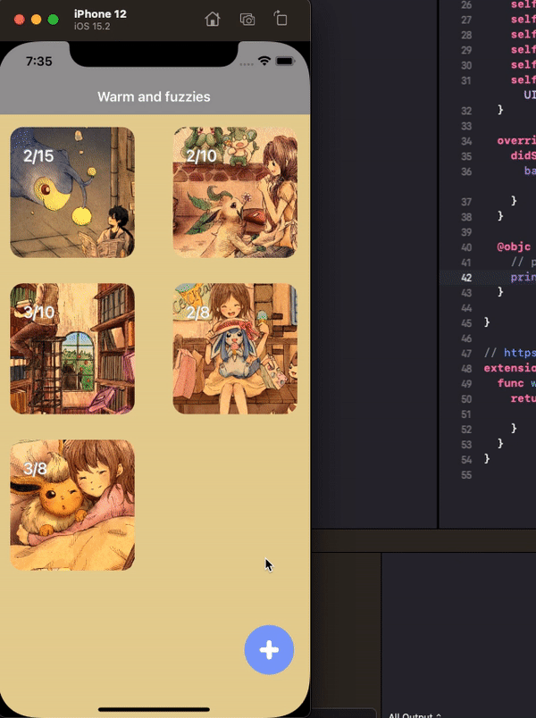

# doggos
premise primarly is just an app to encourage ppl to write 3 things that made them happy that day.
the design clearly doesn't encourage this behavior very well, but backlogging that for now ;D

images credits to google search for things that make me smile :D

3/30/2023 status:
(whoops has been more than a year)

Updating to add architecture diagram to help with ramping up more quickly next time on organization and structure: https://lucid.app/lucidchart/a237a76a-cb06-41fe-b576-4ff948041229/edit?viewport_loc=368%2C23%2C1613%2C1006%2C0_0&invitationId=inv_adc82e03-cb61-4463-8842-70c29ec2a197

low key, not sure if this mvvm model is even what kids these days do. it seems to create a lot of unnecessary file bloat at the very least, but i probably just don't know what i'm doing (y)
3/14 status:

3/27 status:
- created fake data manager
- created viewModel to call from and listen to data updates from VC with
- created composer button view
- added composer button view as floating button to main VC

